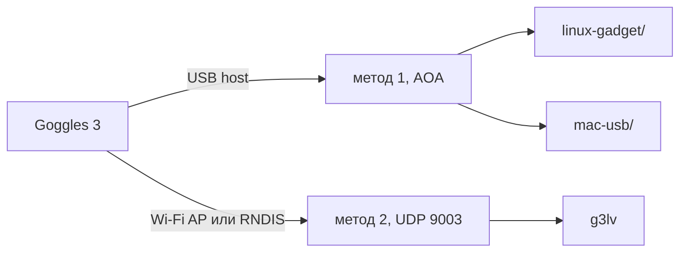

# DJI Goggles 3

Liveview двумя путями. Второй (IP) проверен на Goggles 3.

1. USB gadget — очки в режиме host, комп отвечает как Android accessory.
   Pi: `linux-gadget/`. Mac: `mac-usb/`.
2. IP — Share Live View, UDP `:9003`. Клиент: `ip-liveview/c/g3lv`.

OTG включён → первый. OTG выкл + share по Wi-Fi или USB → второй.



| | USB gadget | IP, только G3 |
| --- | --- | --- |
| роль очков | USB host | USB device или точка доступа |
| комп | gadget, VID `18d1:2d01` | клиент на `:9003` |
| видео | `55 CC 4A 57` + Annex-B на bulk | type-2, H.264 с offset `0x14` |
| очки на USB | | `2CA3:0020` |

## USB gadget

AOA: vendor `0x33`/`0x34`/`0x35`, потом accessory `18d1:2d01`, DUML, кадры на bulk.
Linux и Mac — одна и та же USB-роль, разный API.

Pi 4B, `dwc2` peripheral (`dtoverlay=dwc2,dr_mode=peripheral` в `config.txt`):

```sh
sudo modprobe raw_gadget
sudo env PYTHONPATH=linux-gadget python3 -m pi_endpoint.endpoint --out /tmp/goggles.h264 -v
```

Apple Silicon, контроллер `usb-drd0` или `usb-drd1`:

```sh
cd mac-usb
make userspace kext
./scripts/stage.sh
sudo ./link --controller usb-drd0
./scripts/unstage.sh
```

Как грузить kext: [docs/03-macos-kext.md](docs/03-macos-kext.md).
Протокол: [docs/01-usb-gadget.md](docs/01-usb-gadget.md).

`gold_app_seq.py` пустой — туда нечего класть из захватов с MAC/BSSID.

## IP liveview (Goggles 3)

На очках Share Live View to a Mobile Device via Wi-Fi, либо USB без OTG
(Remote NDIS).

| | адрес очков | у себя |
| --- | --- | --- |
| Wi-Fi | `192.168.2.1:9003` | DHCP с SSID очков |
| USB, Windows | `192.168.60.2:9003` | `192.168.60.1/24`, gateway пустой |
| USB, macOS | то же | `tetherkit-cli`, интерфейс `feth0` |

```sh
make -C ip-liveview/c
./ip-liveview/c/g3lv --wifi -v
./ip-liveview/c/g3lv --wired --boost -v
```

На Windows RNDIS уже есть. На macOS нет — отсюда tetherkit.

Bitrate-hint: DUML `0x51/0x29` на USB interface 4 (`2CA3:0020`). Если
собрано с libusb, `g3lv --boost` пишет туда. Иначе тот же пакет уходит
UDP type-5. Не вызывать `set_configuration` — спадёт RNDIS.

UDP, 8 байт LE: `length|0x8000`, session, seq, type, XOR байт 0..6.

| type | |
| --- | --- |
| 0 | handshake, 48 байт |
| 1 | телеметрия, ~10 Hz |
| 2 | видео, seq += 8 |
| 4 | ACK; без него стрим останавливается. resend: первая дыра первой, иначе G3 игнорирует список |
| 5 | command (в т.ч. bitrate DUML) |

Hint `0x1B → 0xEE`, 22500 kbps / 250 ms — это report, ABR очков его может
не слушать.

Стрим High Profile, IDR почти нет, поэтому `ffplay -f h264` и VideoToolbox
на пайпе обычно не живут. `g3lv` пишет Annex-B. Окно: `liveview.py`
(libav `FLAG2_SHOW_ALL`, в ffplay уже raw YUV).

Протокол подробнее: [docs/02-ip-liveview.md](docs/02-ip-liveview.md).
Разбор Windows-клиента: [docs/squirrel_exe_reverse.txt](docs/squirrel_exe_reverse.txt),
строки: [docs/squirrel_rdata_dump.txt](docs/squirrel_rdata_dump.txt).

| папка | |
| --- | --- |
| `linux-gadget/` | метод 1, Pi |
| `mac-usb/` | метод 1, Mac |
| `ip-liveview/c/` | метод 2, `g3lv` |
| `ip-liveview/` | тот же протокол на Python + вьюер |
| `docs/` | заметки |
