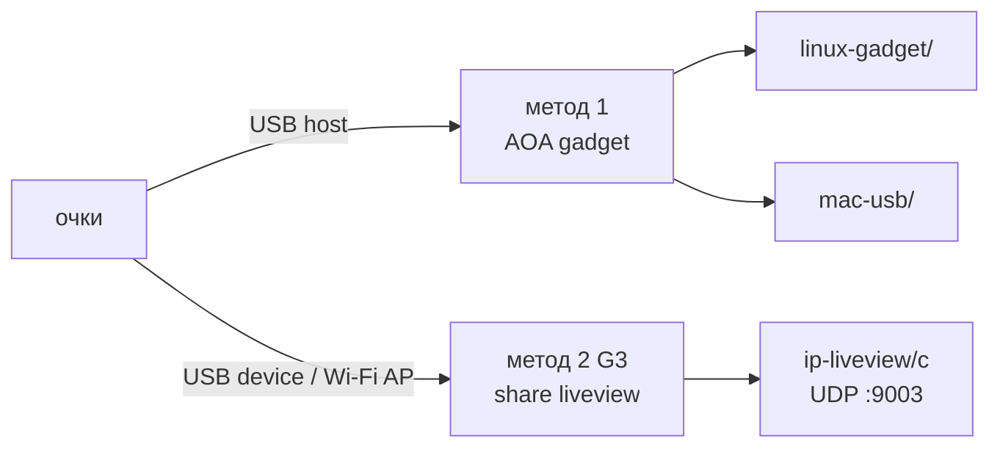
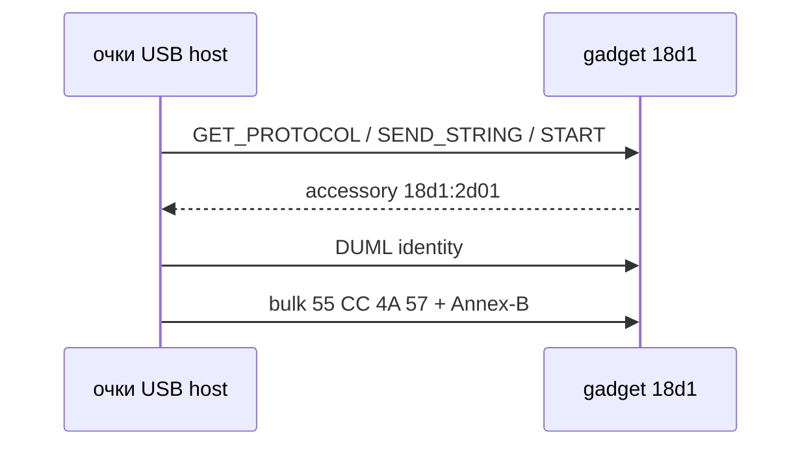
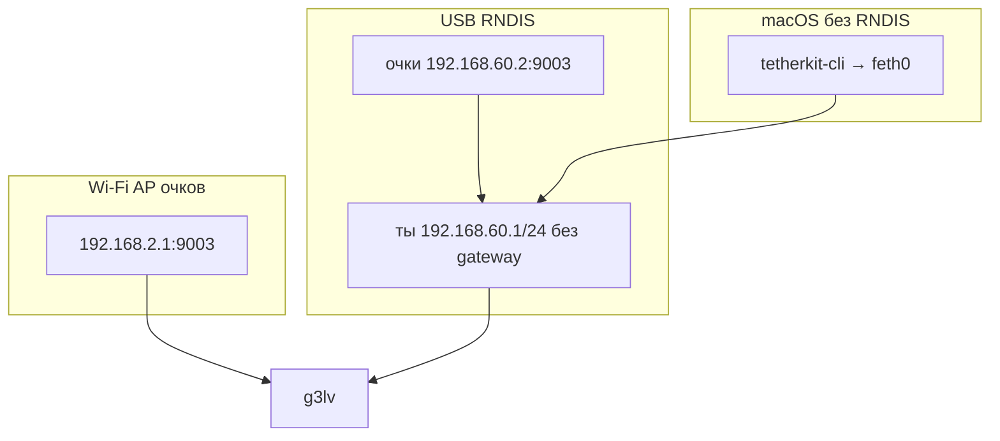
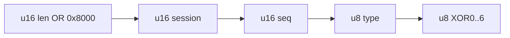
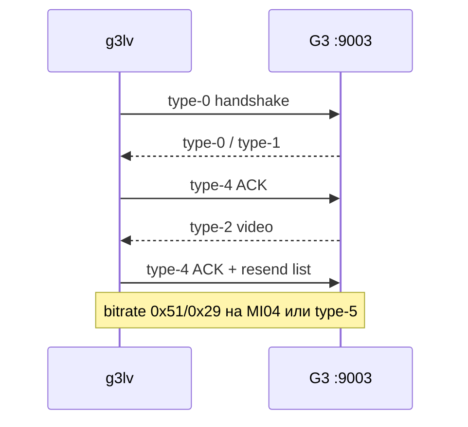
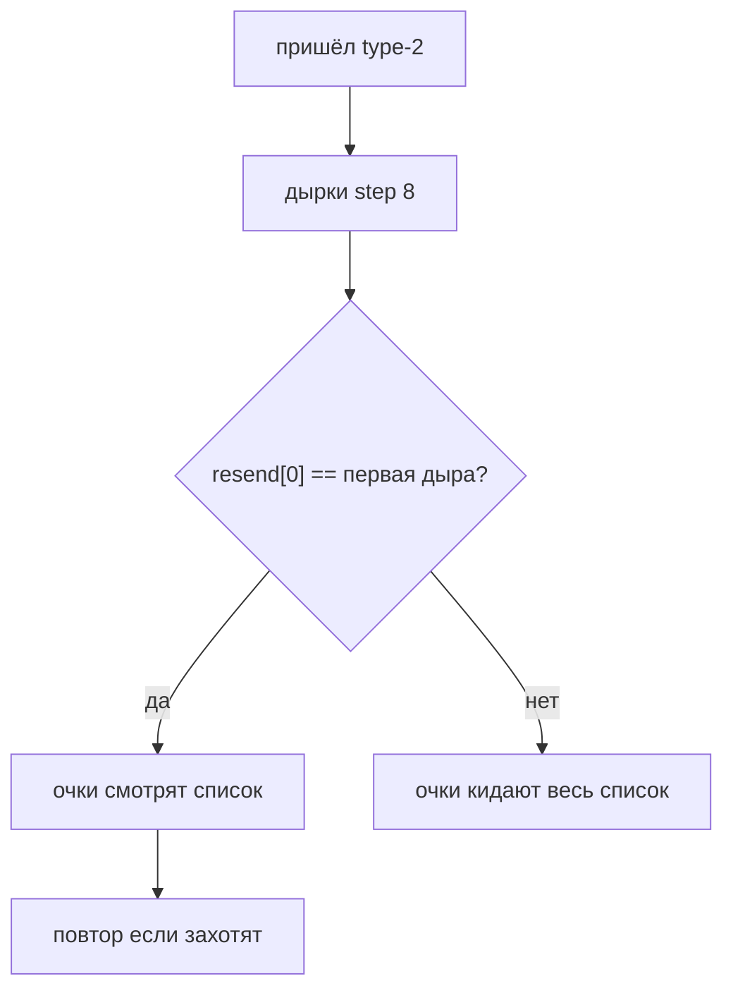

# DJI Goggles — работа с очками

Два метода liveview. Не три. Не «ещё один драйвер». Два.

Метод 2 (IP) я снимал **только с Goggles 3**. Integra / G2 — не обещаю.

Приёмник метода 2 — **C** (`ip-liveview/c/g3lv`). Python в `ip-liveview/`
остался как заметки и как корявый вьюер, если без ffplay совсем плохо.



|  | Method 1 | Method 2 (только Goggles 3) |
| --- | --- | --- |
| очки | USB host (OTG / dongle) | USB device или Wi-Fi AP |
| комп | gadget (Pi или Mac) | UDP-клиент на `:9003` |
| кабель | очки хостят порт | OTG выкл, очки остаются device |
| видео | `55 CC 4A 57` + Annex-B | type-2 UDP, H.264 с `+0x14` |
| USB ID | gadget `18d1:2d01` | очки `2CA3:0020` |
| код | `linux-gadget/` `mac-usb/` | `ip-liveview/c` |

OTG на очках = метод 1. OTG выкл + Share Live View = метод 2.
Перепутаешь роли — будешь неделю «чинить протокол», а виноват кабель.

## Method 1 — USB gadget

Очки думают, что ты телефон. AOA, потом H.264 на bulk. Linux и Mac —
**один** USB-метод, API гаджета разный.



Linux (`linux-gadget/`), Pi 4B, `dwc2` peripheral:

```sh
# /boot/firmware/config.txt : dtoverlay=dwc2,dr_mode=peripheral
sudo modprobe raw_gadget
sudo env PYTHONPATH=linux-gadget python3 -m pi_endpoint.endpoint --out /tmp/goggles.h264 -v
```

macOS (`mac-usb/`), Apple Silicon, `usb-drd0` / `usb-drd1`:

```sh
cd mac-usb
make userspace kext
./scripts/stage.sh
sudo ./link --controller usb-drd0
./scripts/unstage.sh
```

Kext: [docs/03-macos-kext.md](docs/03-macos-kext.md).
DUML/AOA: [docs/01-usb-gadget.md](docs/01-usb-gadget.md).

`gold_app_seq.py` пустой специально — в паблик серийники не тащу.

## Method 2 — IP liveview (Goggles 3)

Я не притворяюсь телефоном. G3 сами шарят liveview на UDP.

На очках: **Share Live View to a Mobile Device via Wi-Fi**, либо USB
без OTG (Remote NDIS).



```sh
make g3lv
./ip-liveview/c/g3lv --wifi -v
./ip-liveview/c/g3lv --wired --boost -v
```

`libusb` если есть в pkg-config — bitrate hint на MI04 (`2CA3:0020` if 4).
Нет — тот же DUML уедет UDP type-5. `set_configuration` не трогать:
убьёшь RNDIS и начнёшь винить очки.

Windows RNDIS из коробки. На маке драйвера нет — поэтому tetherkit.

Подробнее: [docs/02-ip-liveview.md](docs/02-ip-liveview.md).

### UDP header

LE. Бит 15 длины всегда `0x8000`. Байт 7 = XOR байт `0..6`.



| Type | что это |
| --- | --- |
| 0 | handshake, 48 байт. Session в хедере |
| 1 | телеметрия ~10 Hz после хендшейка |
| 2 | видео, Annex-B с `0x14`, seq += 8 |
| 4 | ACK обязателен. RTX-список: **первая дыра первой** |
| 5 | command, в том числе bitrate DUML если нет MI04 |



### RTX и bitrate без сказок

RTX на проводе настоящий. Type-4 несёт список пропущенных type-2 seq
(шаг 8). Очки **выкидывают весь список**, если он не начинается с первой
дыры. Тумблер ON в чужом UI при кривом списке — это UI, не радио.



Bitrate hint — тоже настоящий DUML (`0x1B → 0xEE`, `0x51/0x29`, 22500 kbps /
250 ms). Это report, не «залочь 22.5 Мбит». ABR очков остаётся главным.
Слова *boost* — маркетинг.

Стрим High Profile, IDR почти нет. `ffplay -f h264` и VideoToolbox висят.
`g3lv` пишет Annex-B. Кто хочет окно — Python `liveview.py` (PyAV
`FLAG2_SHOW_ALL` → raw YUV в ffplay).

Разбор чужого Windows-клиента: [docs/squirrel_exe_reverse.txt](docs/squirrel_exe_reverse.txt).
Строки/VA: [docs/squirrel_rdata_dump.txt](docs/squirrel_rdata_dump.txt).
Сам `.exe` в репо нет.

## Где что лежит

| папка | метод | |
| --- | --- | --- |
| `linux-gadget/` | 1 | Pi `raw_gadget` |
| `mac-usb/` | 1 | kext + userspace на маке |
| `ip-liveview/c/` | 2 (G3) | `g3lv` — UDP, ACK, RTX, MI04 |
| `ip-liveview/` | 2 | Python: протокол + вьюер |
| `docs/` | | длинные заметки |

`make` в корне: userspace/kext мака и `g3lv`. Тестов в паблик не клал.
