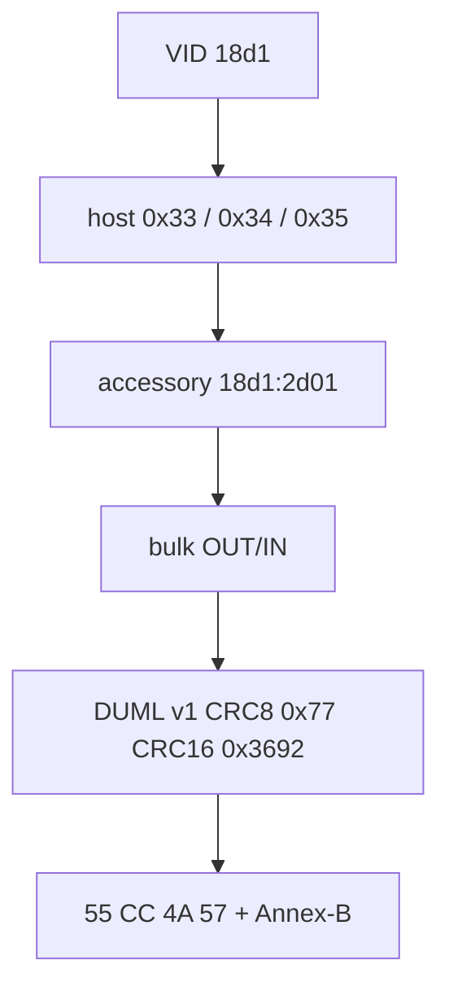

# Method 1 — USB gadget

Очки = USB host. Комп = gadget, якобы Android accessory. Дальше DUML и
H.264 по bulk.

Linux `raw_gadget` и маковский kext — **один метод**. Я просто сделал
оба конца, потому что «на маке нельзя» мне уже надоело слышать.

## Enumeration



| шаг | что происходит |
| --- | --- |
| 1 | VID `18d1`. Linux сначала PID `4ee0`, текущий Mac publish — `2d00`. Строки: DJI / com.dji.logiclink / … |
| 2 | хост: vendor `0x33` GET_PROTOCOL, `0x34` SEND_STRING, `0x35` START |
| 3 | перечисление accessory `18d1:2d01` |
| 4 | bulk OUT очки→gadget, bulk IN gadget→очки |
| 5 | DUML v1, CRC8 seed `0x77`, CRC16 seed `0x3692`, sender type `0x02` |
| 6 | identity `0x81` / `0x82` / `0x88`. Видео `55 CC 4A 57`, LE32 длина, Annex-B |

Если прошивка просит ещё «arm» пакеты — снимай со **своих** очков.
Чужие MAC/BSSID в git не тащи.

## Linux (`linux-gadget/`)

Pi 4B. `dtoverlay=dwc2,dr_mode=peripheral`. Питание 5V на GPIO, иначе
USB-C начнёт жрать VBUS очков и роли поедут.

```sh
sudo modprobe raw_gadget
sudo env PYTHONPATH=linux-gadget python3 -m pi_endpoint.endpoint \
  --out /tmp/goggles.h264 --log-dir /tmp/goggles-logs -v
```

`gold_app_seq.py` пустой. Identity без серийников — в `aoa.py`.

## macOS (`mac-usb/`)

`IOUSBDeviceController` на `usb-drd0` / `usb-drd1`. Kext держит стоковый
NCM (`05AC:1905`), публикует accessory на lease, откатывает если userspace
помер. `link` открывает user client type 123.

Очки строго host (OTG). Не тот Type-C — не тот drd. Смотри `watch`.

Kext: [03-macos-kext.md](03-macos-kext.md).

## Это не оно

RNDIS или Wi-Fi AP очков = метод 2, и он **только G3**.
