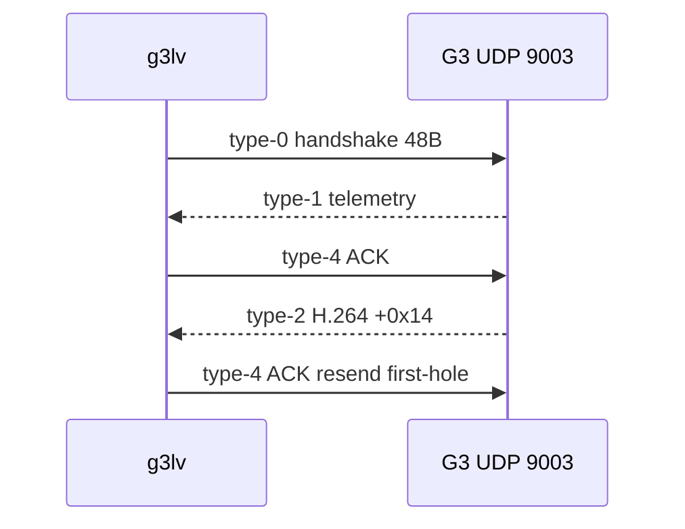

# Method 2 — IP liveview (только Goggles 3)

G3 сами отдают liveview на UDP 9003. Это не AOA. Goggles 2 / Integra я
сюда не прикручивал.

На очках: **Share Live View to a Mobile Device via Wi-Fi**, либо USB с
OTG **выкл**.

| вход | L2 | ты | очки |
| --- | --- | --- | --- |
| Wi-Fi | AP очков | DHCP | `192.168.2.1:9003` |
| Windows USB | Remote NDIS | `192.168.60.1/24`, без gateway | `192.168.60.2:9003` |
| macOS USB | `tetherkit-cli` → `feth0` | тот же /24 | тот же peer |

Приёмник: `ip-liveview/c/g3lv`. Python (`protocol.py` / `liveview.py`) —
тот же протокол и вьюер. `mac_wired.py` поднимает NIC, потому что у Apple
нет RNDIS. Спасибо Куку.

## UDP header (8 байт)

LE. Бит 15 длины всегда `0x8000`.

| off | размер | поле |
| --- | --- | --- |
| 0 | u16 | length \| 0x8000 |
| 2 | u16 | session |
| 4 | u16 | seq |
| 6 | u8 | type |
| 7 | u8 | XOR байт 0..6 |

| Type | смысл |
| --- | --- |
| 0 | handshake, 48 байт, хвост константа |
| 1 | data / window / DUML ~10 Hz |
| 2 | видео; H.264 с +0x14; seq шаг 8 |
| 3 | file (на проводе видел, тут не использую) |
| 4 | ACK от клиента, без него стрим дохнет |
| 5 | command |
| 6 | ещё один ACK |

Type-4 RTX: пропущенные type-2 seq, шаг 8. **Первая дыра первой**, иначе
очки кидают весь список. Это не я придумал — так G3 себя ведут, чужой
exe в `rtx.rs` это знает и всё равно UI врёт про loss recovery.

MI04 (`2CA3:0020` if 4, class `ff/43/01`): DUML bitrate `0x51/0x29`,
sender `0x1B`, 22500 kbps / 250 ms. Claim if 4. Не reset, не
set_configuration.

## Декодер

High Profile, IDR почти нет. VideoToolbox ждёт RAP до второго пришествия.
`ffplay -f h264` в пайп буферит и после одной потерянной AU всё мажет.
`liveview.py`: `FLAG2_SHOW_ALL` + `LOW_DELAY`, в ffplay уже raw YUV.
Кто скажет «у меня на маке чёрный экран, протокол неверный» — сначала
декодер проверь, я уже.
